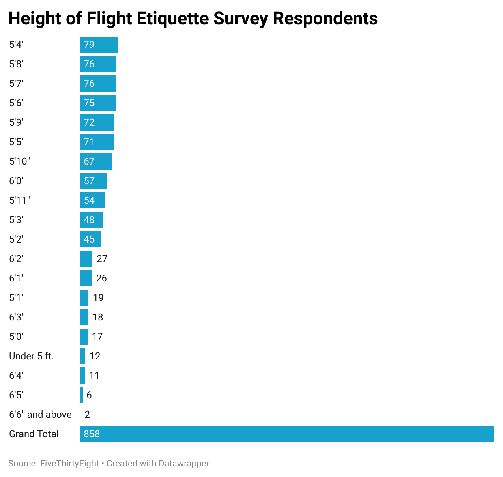

# Quiz-4-Repository
  I chose the question, "How tall are you?" when creating a chart for this quiz because while it's a simple question, I think understanding the count of respondent age can lead to further insight of answers to other questions in the flight etiquette survey.
  For example, someone who is taller may not think it isn't rude to recline a seat, because they have less room in the seat to begin with. Tall people might not be in favor of removing reclining seats. Additionally, they may not find it rude to wake up other passengers to walk around. Therefore, we can have a deeper analysis of skews in the data once we understand the count of respondent heights. I chose to use a bar chart to visualize this data because I thought it showed both the relative difference of height count and the count itself very efficiently.  This chart reveals that the majority of respondents are 5'4" (79), followed by 5'8" (76), and 5'7" (76). While not shown in the chart itself, the data indicates that 340 of the 858 respondents measure 5'9" to 6'6" or above, while 506 are 5'8" or below. 

